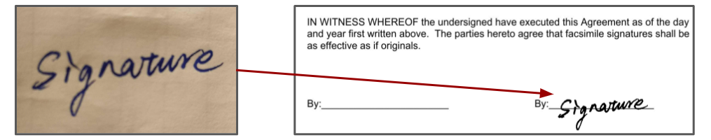

# sign-pdf-with-transparent-background-signature

Sign PDF file with signature photo, the tool extracts signature trace and merge it into PDF with specific page, postions and scale values. Besides it, the repo supports other PDF operation such as merge, OCR, watermark functions.

## Introduction

The tool takes PDF and signature image inputs and output a signed PDF file.



In the picture above, you could see an example of the input photo and output result, the full signed PDF can be found from [files/example-pdf_signed.pdf](./files/example-pdf_signed.pdf):


## Requirements
In Python 3.X environment, install dependencies with `pip install -r requirements.txt`.

## Usage

Put the input files to `./files` folder, and `python main.py -h` to check arguments meaning.
Here lists essential arguments for signing PDF:
```python
'-b', '--base-path', default='./files', type=str, help='Base path to the PDF files for processing'
'-t', '--type-of-manipulation', required=True, type=str, \
              choices=['ocr', 'merge', 'split', 'watermark', 'signature'], \
              help="Type of PDF manipulation"
'-i', '--input-files', required=True, nargs='+', help="Input PDF files name(s), add space between two files"
'-s', '--signature-file', type=str, help="Sinature picture file name"
'-n', '--signature-page-num', type=int, default=1, help="Signature page number [1, +Inf) of PDF file"
'-o', '--signature-offset-xy', type=parse_two_numbers, default=[0,0], help="Offset proportion of x and y coordinates of the signature. Range is [0,1]"
'-c', '--signature-scale', type=float, default=1, help="Scale (0,+inf) the input sgnature file, set it to negative value if need rotate signature"
'-g', '--gray-threshold', type=float, default=100, help="Gray threshold [0,255] to process signature image"
```

### Signature

- Take a signature photo such as the [example](./files/example-signature.jpg).
- Put the signature photo and PDF file to `./files` folder.
- Select the signature page (`-n`), gray threshold (`-g`), scale (`-c`), and offset proportions (`-o`), the later two arguments might need try a few times to get best results.
  - Page starts from 1.
  - Gray threshold's range is [0, 255], it is used to extract signature from photo, the default value should be enough for most cases. If not, adjust it and check result. 
  - Scale's range is [0, +inf), usually needs to decrease the signature size such as 0.3. Set it to negative value will rotate signature.
  - Offset proportion is in X,Y oder, the top-left corner of the PDF page is the origin, Y is horizontal and X is vertical. Range is [0,1]
- With above, run the program to sign signature. The examples signed [PDF](./files/example-pdf_signed.pdf) uses this command:
  ```
  python main.py -t signature -i example-pdf.pdf -s example-signature.jpg -c 0.2 -n 2 -o 0.65,0.72
  ```

### Other functions

Here are some other usage examples assuming you have input files in the `./files` folder:
- OCR pdf and save to txt file
 `python main.py -t ocr -i a.pdf`
- Merge mulitple PDFs into one PDF
 `python main.py -t merge -i a.pdf b.pdf`
- Split one PDF to multiple PDFs
 `python main.py -t split -i a.pdf`
- Add watermark to all pages of PDF file
`python main.py -t watermark -i a.pdf -w watermark.pdf`;
  Add watermark to first (or last) page only
`python main.py -t watermakr -i a.pdf -w watermark.pdf -p first`

## TODO
- [ ] Publish Pypi package.
- [ ] Add frontend webpage.
- [ ] Add .venv to the repo
- [ ] After converting, the file size is increased. Find reason and solve it.

